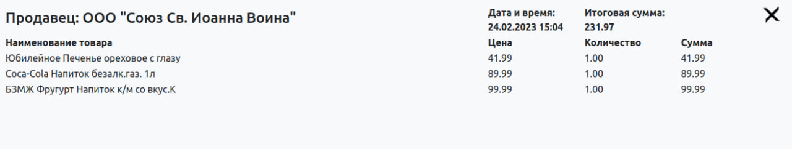

English version is available by [link](README_ENG.md)

# _Hasta La Vista, Money!_  

---------------------------------------------------------------------

Hasta La Vista, Money - проект домашней бухгалтерии для контроля расходов и доходов семьи с возможностью просмотра отчётов
  

Добавлять информацию о чеках можно тремя способами:   
1. С помощью QR-кода с чека, когда магазин работает по 54-ФЗ РФ.  
Сканируем чек в приложении "ФНС. Проверка чека", таким образом добавляем чек  
в личный кабинет и делимся с ботом JSON файлом;   
*_Чтобы добавлять информацию о чеке с QR-кода через приложение "ФНС. Проверка чека",   
необходимо зарегистрироваться в этом приложении._   
2. С помощью текста из QR-кода: t=20230307T082500&s=XXX.XX&fn=XXXXXXXXXXXXXXXX&i=XXXXX&fp=XXXXXXXXXX&n=1   
Сканируем QR-код любым приложением и делимся с ботом текстом, который получили после сканирования;   
*_Для этого потребуется указать ИНН и пароль от личного кабинета налоговой._   
3. Вручную, в соответствующем разделе сайта, когда нет QR-кода на чеке.  

Информация, которая собирается с чеков:
1. Информармация о продавце:  
1.1 Наименование продавца;  
1.2 Адрес покупки (Местонахождение продавца);  
1.3 Название магазина;
2. Информация о самом чеке:  
2.1 Дата покупки;  
2.2 Тип операции (Приход, возврат прихода, расход и возврат расхода);  
2.3 Итоговая сумма чека
3. Информация о продуктах из чека:  
3.1 Наименование продукта;  
3.2 Цена продукта;  
3.3 Количество;  
3.4 Итоговая сумма продукта;  
3.5 Тип НДС;  
3.6 Сумма НДС;
   

---
#### Пример чека, как он выглядит на сайте:  

---

[Документация по проекту](https://hasta-la-vista-money.readthedocs.io)
----------------------------------------------------------------------
